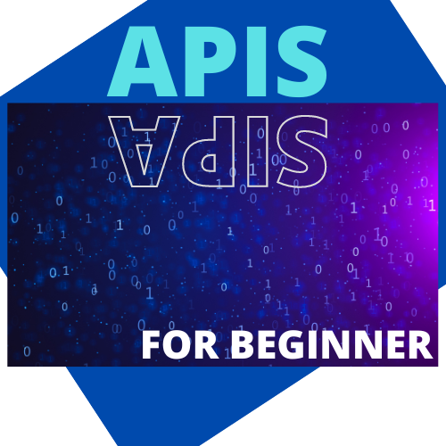

# header

###### 6. Titel

---

## emphesis

- Ich bin **fett** text. Ich bin _kursiv_ or _kursiv_ text.

- Es ist **FETT und _KURSIV_** text.

---

## list

1. Ein Eintrag
2. Ein weiterer eintrag
3. noch ein eintrag
4. noch ein weiterer eintrag

- Ein Eintrag
- Ein weiterer Eintrag
  - Ein untereintrag
  - Ein weiterer untereintag
    - Eine ebene tiefer

---

## link

- [Google](https://www.google.de "Google")

---

## bild



---

## code

```
console.log("Hallo Welt");
alert("Hello");
```

```js
console.log("Hallo Welt");
alert("Hello");
```

---

## zitate

> Ich bin ein **ZITAT**

---

## table

| Database | Collection |
| -------- | ---------- |
| APIs     | Books      |

---

## Links with foto und style

[](https://teknoza-frontend.vercel.app/home "Teknoza")

<br />
<br />
<br />

---
